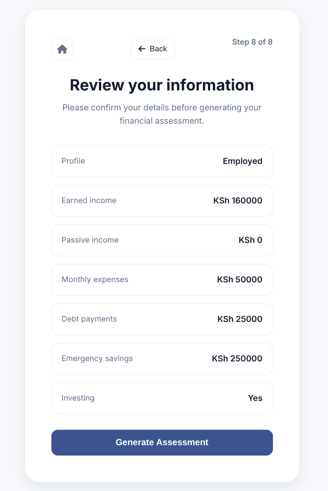
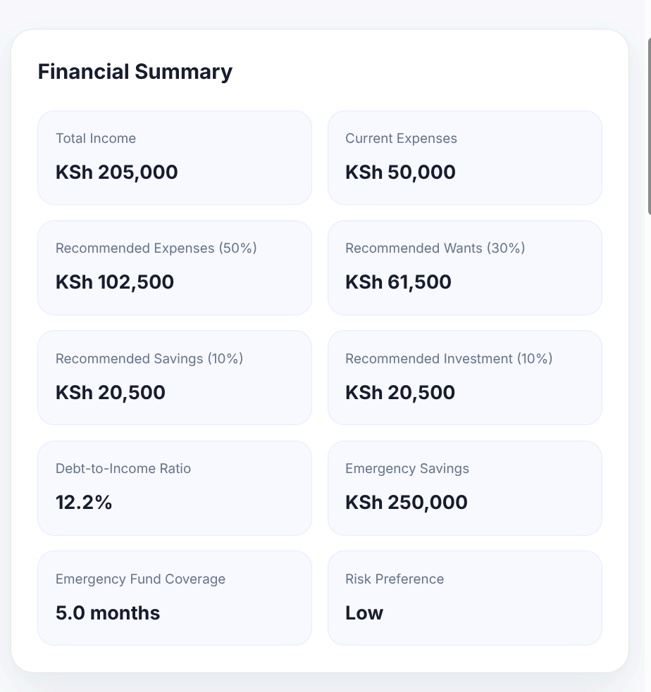
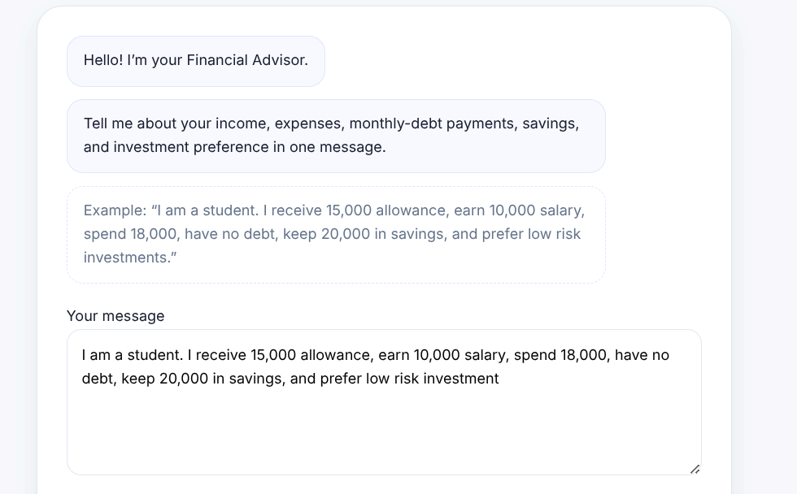

# Personal Finance Advisor Expert System

## Project Overview

Personal Finance Advisor Expert System is a Flask-based rule-based expert system that evaluates a user’s financial health and generates personalized recommendations. The system combines a financial calculator, a knowledge base, and a forward-chaining inference engine to provide budgeting guidance, debt assessment, emergency fund analysis, investment readiness evaluation, and tailored action plans.

## Features

- Multi-step financial assessment wizard
- Conversational “Chat with Advisor” assessment mode
- Rule-based financial reasoning using forward chaining
- Budget analysis based on the 50:30:10:10 model
- Debt-to-income ratio assessment
- Emergency fund adequacy evaluation
- Investment readiness analysis
- Personalized recommendations and action plans
- Responsive user interface with professional styling

## System Architecture

User Interface (Wizard / Chat) → Flask Application → Financial Calculator → Inference Engine → Knowledge Base (JSON Rules) → Results Page

## Technologies Used

- Python 3
- Flask
- HTML5
- CSS3
- JavaScript
- JSON (knowledge representation)

## Project Structure

```
financial-recommendations-using-rule-based-reasoning/
│
├── app.py
├── financialCalculator.py
├── inferenceEngine.py
├── knowledgeBase.py
├── knowledge.json
├── requirements.txt
│
├── templates/
│   ├── base.html
│   ├── assessment.html
│   ├── chat.html
│   └── results.html
│
└── static/
    └── css/
        ├── base.css
        ├── assessment.css
        ├── chat.css
        └── results.css
```

## Setup Instructions

### 1. Clone the repository

```bash
git clone https://github.com/eaMwanika/financial-recommendations-using-rule-based-reasoning
cd financial-recommendations-using-rule-based-reasoning
```

### 2. Create a virtual environment

```bash
python -m venv venv
```

### 3. Activate the environment

**Windows**

```bash
venv\Scripts\activate
```

**Linux / macOS**

```bash
source venv/bin/activate
```

### 4. Install dependencies

```bash
pip install -r requirements.txt
```

### 5. Run the application

```bash
python app.py
```

Open `http://127.0.0.1:5000` in your browser.

## Example Chat Input

> I am a student. I receive 15,000 allowance, earn 10,000 salary, spend 18,000, have no debt, keep 20,000 in savings, and prefer low risk investments.

The system extracts the financial facts, evaluates them using the expert system, and displays a personalized financial report.

## Key HCI Considerations

- Progressive disclosure through step-by-step assessment
- Clear visual hierarchy and consistent card layout
- Error prevention through input validation
- Alternative interaction style through conversational assessment
- Immediate feedback via review and results pages

## Screenshots

### Assessment Wizard


### Financial Inputs



### Financial Results



### Recommendations Results


### Chat with Advisor



## Author

**APT3020 Summer 2026 Group**

Software Engineering Student's

USIU-Africa
